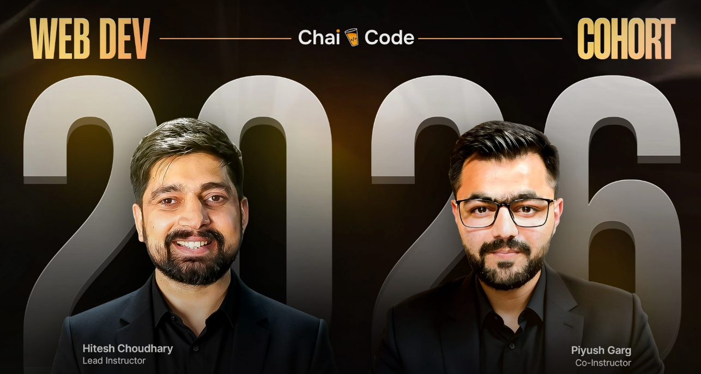

# 🚀 Course Learning Repository

Explore my assignments, projects, blogs and notes as I grow from beginner to developer.

---

  
  

---
## 📌 Introduction

This repository contains my complete learning journey including:

- 📘 Notes
- 📝 Assignments
- 💻 Projects
- ✍️ Blogs

---

## 🗺 Learning Roadmap

| Week | Dates | Topic | 📚 Assignments | 🚀 Projects | ✍️ Blog Posts |
|-----|------|------|------|------|------|
| 00 | 27 Dec | Orientation & Git | - | - | [View](./blogs) |
| 01 | 17 & 18 Jan | Network & DNS | - | - | [View](./blogs) |
| 02 | 24 & 25 Jan | HTML & CSS | [View](./assignments) | - | [View](./blogs) |
| 03 | 31 Jan & 01 Feb | CSS Continued | [View](./assignments) | - | - |
| 04 | 07 & 08 Feb | JS for Beginners | [View](./assignments) | [View](./projects) | - |
| 05 | 14 & 15 Feb | JS Essentials | - | - | - |
| 06 | 21 & 22 Feb | OOP in JS | - | - | [View](./blogs) |
| 07 | 28 Feb & 01 Mar | Async Programming & DOM in JS | - | - | [View](./blogs) |
| 08 | 07 & 08 Mar | TypeScript & Intro to Node + Express | - | - | - |
| 09 | 12 Mar | DOM WITH 5 MINI PROJECTS | - | - | - |
| 10 | 14 Mar | NODEJS ARCHITECTURE | - | - | - |
| 11 | 15 Mar | INTRO TO EXPRESSJS | - | - | - |
| 12 | 19 Mar | T-8 BROWSER EVENTS | - | - | - |
| 13 | 21 Mar | RESTFUL BUILDING-1 | - | - | - |
| 14 | 22 Mar | RESTFUL BUILDING-2 | - | - | - |
| 15| 26 Mar | t-9 oops notes| - | - | - |
|16 | 28 Mar | authentication and Authorisation - (mongoose)| - | - |
|17 | 29 Mar | authentication and Authorisation - (drizzle)| - | - |
|18 | 2 april | T-10 COMPLETE TYPESCRIPT| - | - |
|19 | 4 april | CHAI AUR SQL-1| - | - |
|20 | 5 april | CHAI AUR SQL-2| - | - |
|21 | 11 april | Read and write filesystems| - | - |
|22 | 12 april | ipl management system| - | - |
|23 | 17 april | oidc and oath| - | - |
|24 | 18 april | websocket intro| - | - |
|25 | 24 april | websocket , rate limiting , reddit| - | - |
|26 | 25 april | kafka | - | - |
|27 | 02 may | react-1| - | - |
|28 | 03 may | react-2 | - | - |
|28 | 09 may | react-3 | - | - |
|28 | 10 may | react-4 | - | - |

---

## 📂 Documentation

### 📘 Notes → Learn Concepts
➡ /notes

### 📝 Assignments → Practice
➡ /assignments

### 💻 Projects → Real Implementation
➡ /projects

### ✍️ Blogs → Share Knowledge
➡ /blogs

---

## 🛠 Tech Stack

- Git — Version Control
- HTML — Structure
- CSS — Styling
- JavaScript — Logic

---

## 🤝 Contributing

Contributions are welcome.

---

## 📜 License

MIT License
